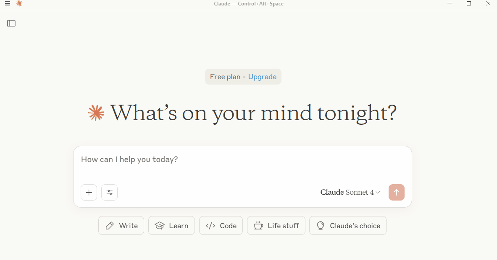

# AutoWP MCP

AutoWP MCP (Model Context Protocol) server connects Claude to WordPress site and allows users to ask Claude to write blog posts and automatically publish them to WordPress sites.

The AutoWP MCP server acts as a bridge between LLMs clients like Claude Desktop and WordPress websites.

## Features

It provides a secure, standardized way for AI assistants to interact with WordPress sites through the WordPress REST API, without the need for direct database access.

## Key Capabilities

- **Authentication & Security**
  - Handles secure login using WordPress application passwords
  - Manages authentication sessions safely
  - Test site connectivity before attempting operations

- **Content Management**
  - Creates and publishes blog posts
  - Formats raw text into WordPress-compatible HTML
  - Manages post metadata (titles, excerpts, status)

- **Site Information Access**
  - Retrieves available categories and tags
  - Accesses the site structure and permissions
  - Respects user role limitations (like your contributor role)

- **Draft Workflow**
  - Saves drafts locally for editing
  - Loads previously saved content
  - Enables iterative content development

## Why It's Useful

Instead of you having to log into WordPress manually, write posts, format content, and manage everything through the web interface, this MCP server helps you create, format, and publish content directly from our conversation. It's a WordPress automation assistant that bridges the gap between AI conversation and WordPress site management.

## WordPress-Specific Tools

- **authenticate-wp** - Connect to WordPress with credentials (which we just used)
- **test-wp-connection** - Test if a WordPress site is reachable
- **create-blog-post** - Create new blog posts with title, content, categories, tags, and status
- **get-wp-categories** - Retrieve all available categories from your WordPress site
- **get-wp-tags** - Retrieve all available tags from your WordPress site
- **format-wp-content** - Convert raw text into WordPress-ready HTML format

## Draft Management Tools

- **save-draft** - Save blog post drafts locally for later use
- **load-draft** - Load previously saved drafts

## What You Can Do With These Tools

- **Content Creation:** Write and format blog posts
- **Category Management:** View and assign existing categories to posts
- **Tag Management:** View and assign existing tags to posts
- **Draft Workflow:** Save drafts locally and work on them over time
- **Publishing:** Create posts as drafts or publish them directly (depending on your user permissions)

## Installation & Authentication
